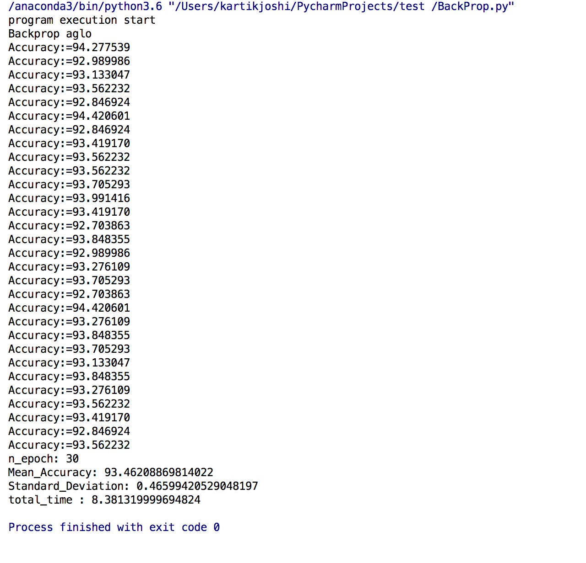
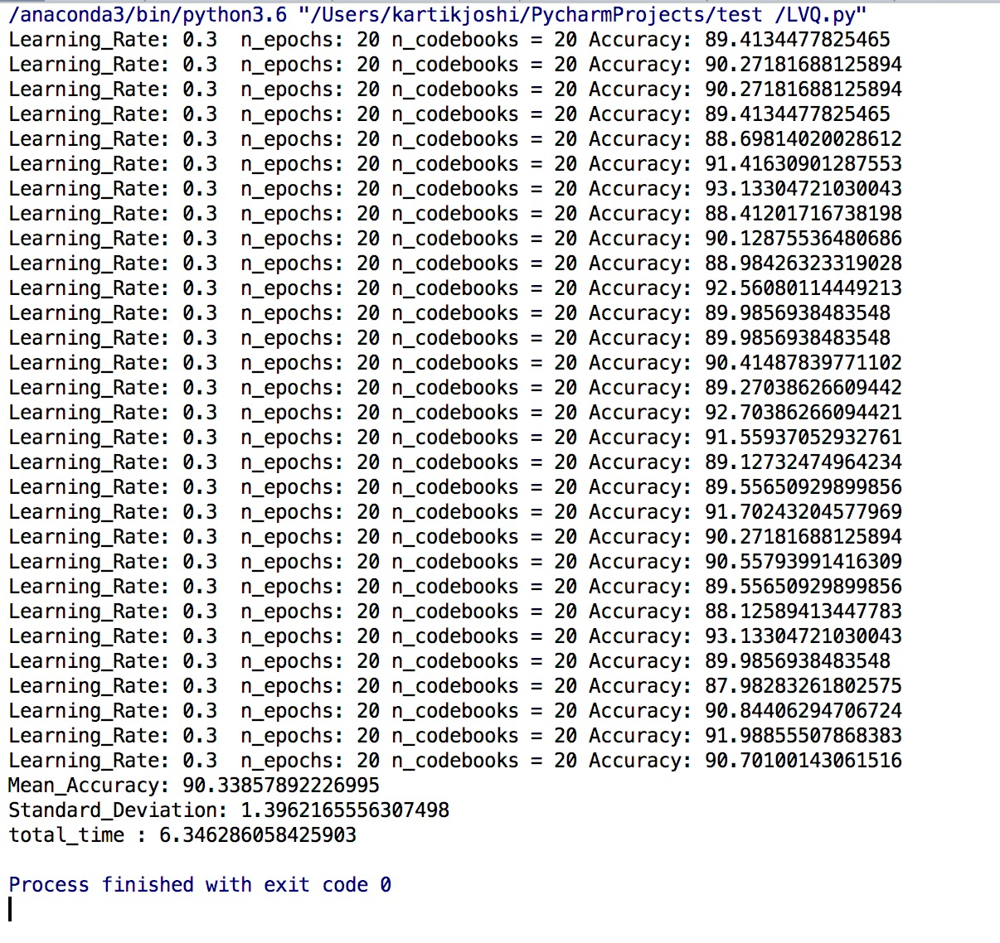
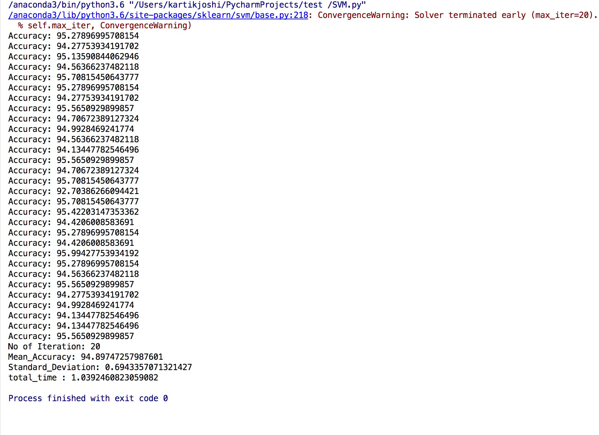

# LVQ-SVM-Backpropagatin-Comparison
LVQ SVM and Backpropagation Algorithm Comparison on Wisconsin dataset

In this three algorithm are implemented. LVQ, SVM and Backpropagation. Their performance is evaluated on breast-cancer-wisconsin dataset. This data set has 10 attributes and its two-class dataset.
Class 0 represents Benign (458 entries) and class 1(251 entries) represents Malignant. Total records in dataset are 699.
Backpropagation and LVQ algorithms are implemented with python code where at each iteration first trained with train dataset and then accuracy is tested on test dataset
SVM is implemented using SciKit Learn library. Where fit method is called on train dataset and then predict method is called on test dataset. All algorithms are tested with same set of data in each iteration.
30 times each algorithm are implemented and from each run-accuracy mean accuracy is calculated. Also, standard deviation is calculated with from this 30 accuracy values.

## Backpropagation Run :

Backpropagation algorithm implemented. To get accuracy we have to use n_epoch = 30 for each run. Here in 30 runs we got more than 90% accuracy. Time taken in computation is 8.38 sec.

## LVQ Run :

 LVQ algorithm implemented. To get accuracy we have to use n_epoch = 20 for each run. Here in 20 runs we got almost 90% accuracy. Total time taken for this is 6.34 sec.
 
 
 
 ## SVM Run :
 SVM algorithm implemented. To get accuracy we have to use n_epoch = 20(No of iteration) for each run. Here in 30 runs of algorithm we got around 95% accuracy all the time. Total time = 1.039 sec
 
 

## T test report:

**Result Table :**
|                     | Backpropagation        | SVM           | LVQ  |
| -------------- | ------------------------- |:-------------:| -----:|
|Mean Accuracy  | 93.4620     |  94.8974 | 90.3385 |
|Standard Deviation   | 0.4659   | 0.6943      |   1.3962 |
|Variation          | 0.2170  | 0.4820 |   1.9493 |

 

In this T test value of a = 0.05. This means that five times out of a hundred there would be a statistically significant difference between the means (Accuracy) even if there was none (i.e., by "chance"). Here the degrees of freedom (df) for the test is 58 as for each algorithm there are 30 runs.

### 1: Backpropagations and SVM:
Testing the Hypothesis that performance of backpropagation and SVM is the same or not.
    1. The hypothesis: H0: Δ = 0 vs. H1: Δ ≠ 0, where Δ = μSVM - μBackpropogation
    2. The rejection region: Reject H0: Δ = 0, if t is not between ± t0.95(58) = 1.701
    3. here t = 9.40 Not in range of ± t0.95(58) = 1.701. So H0 Rejected there is accuracy improvement in Implementation of Backpropagation compare to SVM
    
### 2: Backpropagations and LVQ:
Testing the Hypothesis that performance of backpropagation and LVQ is the same or not.
    1. The hypothesis: H0: Δ = 0 vs. H1: Δ ≠ 0, where Δ = μBackpropogation - μLVQ
    2. The rejection region: Reject H0: Δ = 0, if t is not between ± t0.95(58) = 1.701
    3. here t = 11.62 Not in range of ± t0.95(58) = 1.701. So H0 Rejected there is accuracy improvement in Implementation of Backpropagation compare to LVQ
    
### 3: SVM and LVQ:
Testing the Hypothesis that performance of SVM and LVQ is the same or not.
    1.Thehypothesis: H0:Δ=0vs.H1:Δ≠0,whereΔ=μSVM–μLVQ
    2. The rejection region: Reject H0: Δ = 0, if t is not between ± t0.95(58) = 1.701
    3. here t =16.01 Not in range of ± t0.95(58) = 1.701. So H0 Rejected there is accuracy improvement in Implementation of Backpropogation compare to SVM
    
This result may vary depending on dataset used for each algorithm and how network is initialized in each algorithm

## Observation and Analysis:
For each algorithm, we can get more then 90% accuracy. For backpropagation, it requires 30 iterations to reach that value but for LVQ and SVM we can achieve this with 20 iterations only. The comparison sequence for computation required will be SVM < LVQ < Backpropagation and for accuracy achieved will be SVM> Backpropagation > LVQ. All algorithm accuracy depends on how we assign attributes while training(fitting). If we give less or more learning rate (penalty) of or epoch (max_iteration) value then it will reduce accuracy. For each algorithm, there is a set of values for each attribute for which we get max accuracy.
From T test run we can say that there is a difference between mean accuracy value for each pair of algorithm. Using that result we can say that we can get significance performance difference if we switch from one algorithm to another.

## Conclusion:
All of three LVQ, SVM and Backpropagation has different value for final accuracy, and computational efforts required for training. Also, we can get improvement in accuracy if we switch from one algorithm to another. This accuracy improvement may vary depending on what dataset you are trying to predict. All three algorithms have sensitive attributes (learning rate and epoch) and accuracy value depends on how we assign values for those.

## References:
**[SciKit Learn SVM Reference](http://scikit-learn.org/stable/modules/svm.html#svm-classification)
**[Reference paper](https://www.socialresearchmethods.net/kb/stat_t.php)
**[Reference paper](http://www.itl.nist.gov/div898/handbook/eda/section3/eda3672.htm)
**[LVQ Algorithm Reference](https://machinelearningmastery.com/learning-vector-quantization-for-machine-learning/)
